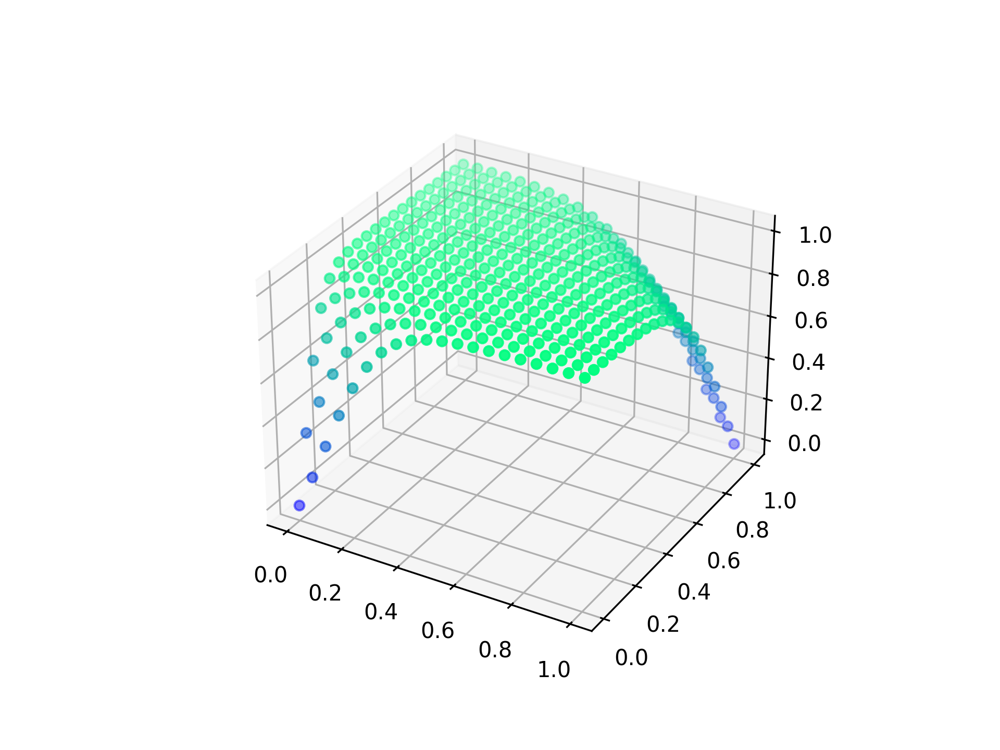
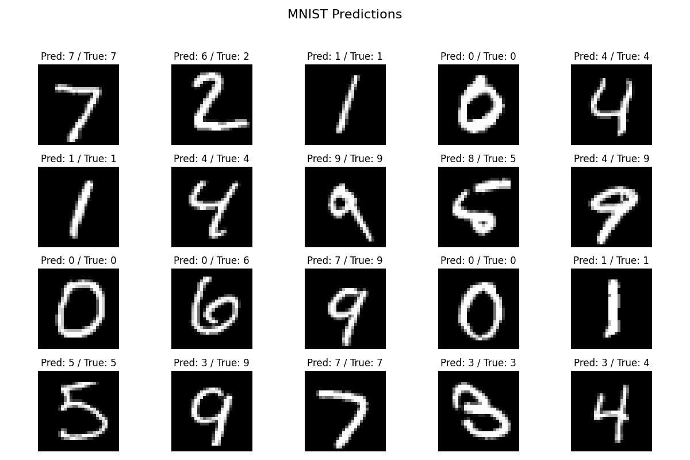

# Neural Network Implementation from Scratch

This repository contains a modular implementation of neural networks built entirely from scratch using NumPy. The project demonstrates fundamental concepts of deep learning by implementing various layer types, activation functions, and applying them to classic problems.

## Project Structure

```
├── layer.py          # Base Layer class
├── dense.py          # Dense/Fully Connected layer
├── activation.py     # Base Activation layer
├── activations.py    # Various activation functions
├── mse.py            # Mean Squared Error loss
├── network.py        # Network training functions
├── mnist_example.py  # MNIST digit recognition
├── xor_example.py    # XOR problem visualization
```

## Features

- **Modular architecture**: Easy to extend with new layer types and activation functions
- **Multiple activation functions**: Tanh, Sigmoid, Softmax
- **Visualization tools**: Decision boundaries and prediction results
- **Example applications**: XOR problem and MNIST digit recognition

## Implementation Details

### Layer Architecture

The neural network is built on a simple layered architecture with a common interface:

```python
class Layer:
    def __init__(self):
        self.input = None
        self.output = None
        
    def forward(self, input):
        pass 
    
    def backward(self, output_gradient, learning_rate):
        pass
```

All layer types (Dense, Activation, etc.) extend this base class and implement the forward and backward methods for forward propagation and backpropagation.

### Dense Layer

```python
class Dense(Layer):
    def __init__(self, input_size, output_size):
        self.weights = np.random.randn(output_size, input_size)
        self.bias = np.random.randn(output_size, 1)
        
    def forward(self, input):
        self.input = input
        return np.dot(self.weights, self.input) + self.bias
    
    def backward(self, output_gradient, learning_rate):
        weights_gradient = np.dot(output_gradient, self.input.T)
        self.weights -= learning_rate * weights_gradient
        self.bias -= learning_rate * output_gradient
        return np.dot(self.weights.T, output_gradient)
```

### Activation Functions

The framework includes multiple activation functions:

- **Tanh**: Hyperbolic tangent activation
- **Sigmoid**: Logistic activation
- **Softmax**: For multi-class classification problems

### Training and Prediction

The network module provides utility functions for training and prediction:

```python
def predict(network, input):
    output = input
    for layer in network:
        output = layer.forward(output)
    return output

def train(network, loss, loss_prime, x_train, y_train, epochs=1000, learning_rate=0.01, verbose=True):
    for e in range(epochs):
        error = 0
        for x, y in zip(x_train, y_train):
            # forward
            output = predict(network, x)
            # error
            error += loss(y, output)
            # backward
            grad = loss_prime(y, output)
            for layer in reversed(network):
                grad = layer.backward(grad, learning_rate)
        error /= len(x_train)
        if verbose:
            print(f"{e + 1}/{epochs}, error={error}")
```

## Applications

### XOR Problem

The XOR problem is a classic example that demonstrates the need for multi-layer neural networks, as it's not linearly separable.

```python
X = np.reshape([[0, 0], [0, 1], [1, 0], [1, 1]], (4, 2, 1))
Y = np.reshape([[0], [1], [1], [0]], (4, 1, 1))

network = [
    Dense(2, 3),
    Tanh(),
    Dense(3, 1),
    Tanh()
]

train(network, MSE, MSE_prime, X, Y, epochs=10000, learning_rate=0.1)
```

#### Decision Boundary Visualization:



The 3D visualization shows how the neural network learns to separate the XOR function in the parameter space.

### MNIST Digit Recognition

The MNIST dataset is used to demonstrate how the neural network can be applied to a real-world image classification problem.

```python
network = [
    Dense(28 * 28, 40),
    Tanh(),
    Dense(40, 10),
    Tanh()
]

train(network, MSE, MSE_prime, x_train, y_train, epochs=100, learning_rate=0.1)
```

#### MNIST Predictions:



The visualization shows a sample of test images along with their predicted and true labels.

## Usage

To run the examples:

1. Ensure you have NumPy, Matplotlib, and Keras (for dataset loading only) installed
2. Run the examples:
   ```
   python xor_example.py
   python mnist_example.py
   ```

## Extensions

This implementation can be extended in several ways:

1. Add more layer types (Convolutional, Pooling, BatchNorm)
2. Implement additional activation functions (ReLU, LeakyReLU)
3. Add regularization techniques (L1, L2, Dropout)
4. Support for other loss functions (Cross-Entropy, Hinge)
5. Implement optimization algorithms (Adam, RMSProp)

## References

- [Neural Networks and Deep Learning](http://neuralnetworksanddeeplearning.com/) by Michael Nielsen
- [Deep Learning](https://www.deeplearningbook.org/) by Ian Goodfellow, Yoshua Bengio, and Aaron Courville
